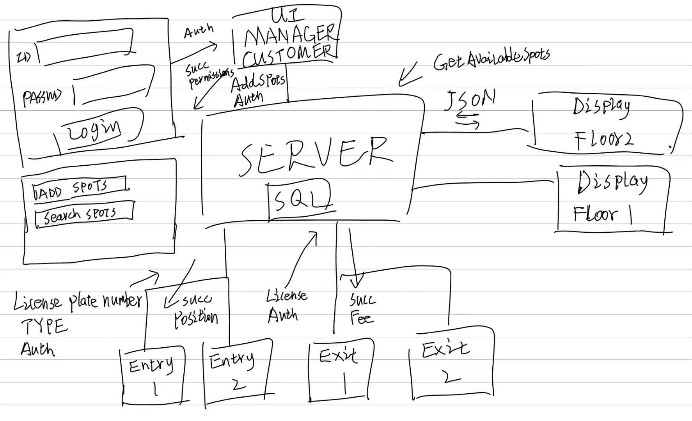
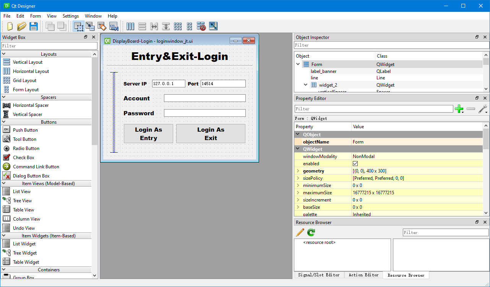
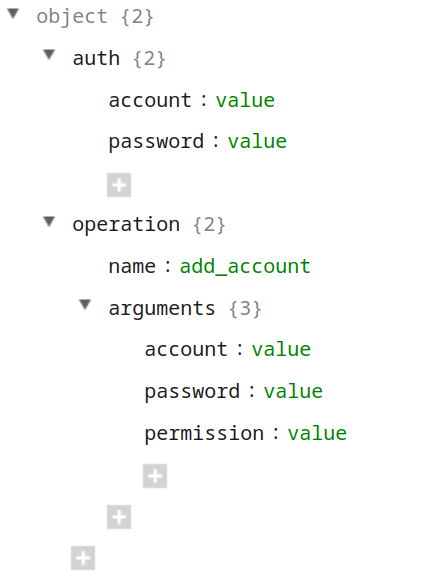

# Project Develop

## Develop Analyze and Plan

The development plan is a crucial component for the successful completion of our C++ project. It outlines the project's overall objectives, timeline, and division of work. The following is our group's development plan for developing this project.

1. Define project objectives:

   Prior to commencing the project, we will establish clear objectives and requirements.  First, we had a quick discussion to determine the topic (Group C: parking system). After that, we divided into two groups: development group and documentation group. At the same time, we decided to use WeChat for intra-group communication and Git for code and document progress synchronization. The development and documentation teams choose their own toolchains and internal divisions. Finally, the team leader creates the GitHub repository and sets up the main-dev-feature development stream.

2. Division of Work:

   We will assign specific responsibilities to each team member based on their strengths, skills, and interests. As a team, we will collaboratively determine the tasks and deliverables for each phase of the project. This will promote effective teamwork and ensure that each team member contributes to the project's success.

   a. Development Team:

   Two team members will be responsible for the actual development of the C++ project. The development team members communicated quickly, designed a project solution with high cohesion and low coupling (see below), and quickly implemented it. It is worth mentioning that one of the project team members, whose computers are all based on the GNU Linux operating system, will complete the project using platform - and compiler-independent syntax.

   b. Documentation Team:

   The other two team members will be responsible for preparing the project report and documentation. They will collect and organize relevant information about the project, including the design decisions, implementation details, and test results. They will ensure that the project report is well-structured, concise, and accurately represents the work completed. In addition, because Git is based on version control of changes to text files, it does not work well with MS Word files (such as .docx). The documentation team uses $\LaTeX$ to write documents, a format that uses plain text to record the original content and can easily generate pdf files.

By following this development plan, we aim to successfully complete the C++ project within the given timeframe while meeting all the project requirements and delivering a high-quality solution.

## Project Architecture

In order to balance development efficiency and code quality, the team adopted a frontend-backend separation architecture design. Frontend-backend separation, also known as UI and code logic separation, has several benefits. Firstly, it allows for a clear separation of concerns, enabling frontend developers to focus on designing an intuitive and visually appealing user interface (UI), while backend developers can concentrate on implementing complex business logic and data processing. This division of labor promotes specialization, enhances productivity, and enables parallel development. Secondly, it facilitates scalability and flexibility by providing the ability to upgrade or replace either the frontend or backend independently, without affecting the other component. Lastly, it promotes code reusability and maintainability, as changes made to one component are less likely to impact the other, simplifying debugging and reducing the overall development and maintenance effort.

The frontend of our project utilizes the Qt framework, a popular cross-platform application development framework. Qt provides a comprehensive set of tools and libraries for building graphical user interfaces (GUIs) efficiently. We leverage the Qt Designer tool to visually design the UI components, arrange layouts, and define their properties. Additionally, the Qt User Interface Compiler (uic) tool converts the UI design files into C++ code that can be seamlessly integrated with the backend logic. By leveraging the Qt toolchain, we can streamline the frontend development process, enhance code reusability, and achieve a consistent and visually appealing user interface across different platforms.

The communication between the frontend and backend of our project is facilitated using the TCP (Transmission Control Protocol) protocol. TCP provides a reliable and connection-oriented communication channel between the client (frontend) and server (backend). This ensures that data packets are delivered in order and without loss or corruption.

To facilitate the exchange of data between the frontend and backend, we utilize the JSON (JavaScript Object Notation) format for serialization and transmission. JSON is a lightweight and widely supported data interchange format that allows for easy representation and parsing of structured data. By using JSON, we can effectively serialize complex data structures into a human-readable format that can be transmitted over the TCP connection, enabling seamless communication and data exchange between the frontend and backend components of our project.

## Develop Test

Testing is a crucial step in the development process. At the end of the testing, the code is delivered to the customer. It ensures that the software functions as intended, identifies any defects or issues, and verifies that the system meets the specified requirements. In the case of a frontend-backend separated project, testing becomes essential to ensure the seamless interaction between the UI and backend components. The testing process for our project involves  separate unit testing for both the UI and the backend components,  followed by integration testing to ensure their seamless interaction.

We first tested each modular unit independently to ensure that the layout, appearance and behaviour of the front-end UI elements matched the design, and that the back-end units performed the expected actions and produced the expected output correctly.

After all the UI annd backend components have undergone thorough unit testing, integration testing takes place. It verifies that the frontend and backend functionalities work together harmoniously, ensuring proper data exchange and preserving the desired system behavior.

After testing, we merge the code from the dev branch to the main branch, indicating that the code has been accepted and moved from development to maintenance status.
